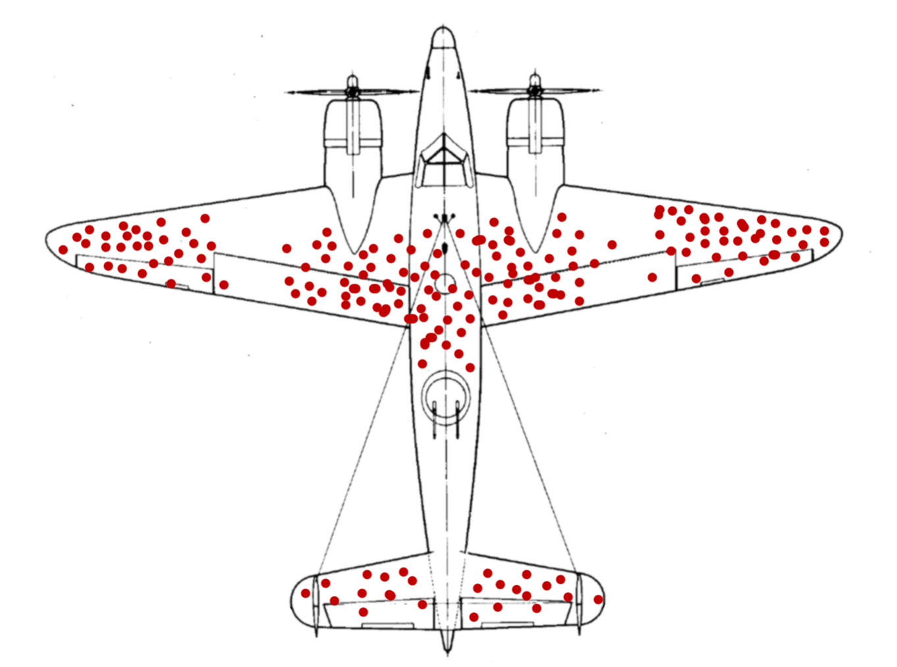

---

--

$$\\[12cm]$$

**Você nunca sabe o resultado do caminho que você não toma.**

---

# Quais as aplicações do que vamos discutir?

Há uma série de **questões de pesquisa** que poderiam ser investigadas com as ferramentas que vamos discutir hoje.

--

1) Vale mais a pena estudar em escola particular ou pública?

--

2) Qual o efeito de investimentos de marketing têm na lucratividade?

--

3) Qual o efeito que jornadas de 4 dias semanais têm na produtividade?

--

4) Qual efeito que educação tem na remuneração futura?

--

5) E diversas outras semelhantes...

---

# Antes de começar: Nossa agenda

1) Introdução a **pesquisa quantitativa**

--

2) Validade **Externa** vs. Validade **Interna**

--

3) **Problemas** em pesquisa quantitativa inferencial

--

4) **Remédios**

--

5) Práticas de **Open Science** (se der tempo)

---

# Mais um pouco de contexto...

$$\\[3cm]$$

**Há dois núcleos em pesquisa em Finanças no IAG:**

--

- [Nupei](http://nupei.iag.puc-rio.br/)

    - Definição macro: Aborda tópicos relacionados a decisões de investimento em Energia e Infra-estrutura
    
--

- [Fine](https://iag.puc-rio.br/fine/)

    - Definição macro: adota tópicos de alocação de recursos financeiros
        - Mercados Financeiros
        - Finanças Corporativas
        - Derivativos

---

# Mais um pouco de contexto...

$$\\[3cm]$$

**Há dois núcleos em pesquisa em Finanças no IAG:**

- [Nupei](http://nupei.iag.puc-rio.br/)

    - Definição macro: Aborda tópicos relacionados a decisões de investimento em Energia e Infra-estrutura
    
- [Fine](https://iag.puc-rio.br/fine/)

    - Definição macro: adota tópicos de alocação de recursos financeiros
        - **Mercados Financeiros**
        - **Finanças Corporativas**
        - Derivativos

        
---

class: left

# Introdução...

**O que fazemos em pesquisa quantitiva?**

--

Seguimos o método de pesquisa tradicional (com ajustes):

--

- Observação 

--
  
- Questão de pesquisa 

--

- Modelo teórico (abstrato)

--

- Hipóteses

--

- Modelo empírico

--

- Coleta de dados 

--
  
- Análise do resultado do modelo (diferente de análise de dados "pura")

--

- Conclusão/desdobramentos/aprendizados
  

---

class: left

# Introdução...

**O que fazemos em pesquisa quantitiva?**

Seguimos o método de pesquisa tradicional (com ajustes):

- Observação 

- Questão de pesquisa 

- Modelo teórico (abstrato): **Aqui é onde a matemática é necessária**

- Hipóteses

- Modelo empírico: **Estatística e econometria necessárias**

- Coleta de dados: **Geralmente secundários**

- Análise do resultado do modelo (diferente de análise de dados "pura")

- Conclusão/desdobramentos/aprendizados

---

class: left

# Definição

**_Pesquisa quantitativa busca testar hipóteses..._**

--

**_...a partir da definição de modelos formais (abstratos)..._**

--

**_...de onde se estimam modelos empíricos utilizando a estatística e a econometria como mecanismos/instrumentos._**

--

$$\\[2cm]$$

No fim do dia, buscamos **entender as relações** (que tenham **validade interna** e que ofereçam **validade externa**) entre diferentes **variáveis de interesse.**

---

class: left

# Quais as vantagens?

1) **Validade externa:** 

--

- Conceito de que, se a pesquisa tem validade externa, os seus **achados são representativos**.

--

- I.e., são **válidos além do seu modelo**. Resultados "valem externamente".

--

- Idealmente, buscamos resultados que valem externamente para **acumular conhecimento**...

--

- ...naturalmente, nem toda pesquisa quantitativa oferece validade externa. A pesquisa ótima sim. **A pesquisa excelente tem validade externa para além do seu tempo**.

--

- Pesquisa qualitativa dificilmente oferece **validade externa**.

---

class: left

# Quais as armadilhas?

2) **Validade interna:** 

--

- Conceito de que a pesquisa precisa de validade interna para que seus **resultados sejam críveis**.

--

- I.e., os **resultados não podem conter erros**, vieses, problemas de estimação, problemas nos dados, etc..

--

- É aqui que a gente separa a pesquisa ruim da pesquisa boa. Para ser levada a sério, a pesquisa **PRECISA** ter validade interna.

--

- Mas isso, nem sempre é trivial. Muitas pesquisas que vemos publicadas, mesmo em top journals, **não têm validade interna** (seja por erro do pesquisador, por método incorreto, por falta de dados...)

--

- Mas cada vez mais, **avaliadores estão de olho** em problemas e em modelos  **Trash-in-Trash-out**

---

# Como fazemos na prática?

Exemplo de modelo empírico:

$Y_{i} = α + 𝜷_{1} × X_i + Controls + error$

--

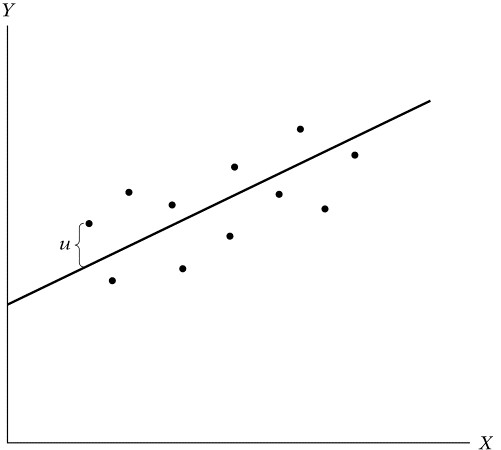

--

Uma vez que estimemos esse modelo, temos o **valor**, o **sinal** e a **significância** do $𝜷$.

--

Se o Beta for **significativamente diferente de zero** e **positivo** --> X e Y estão positivamente correlacionados.

--

**O problema?** Os pacotes estatísticos que utilizamos **sempre "cospem" um beta**. Seja ele com ou sem viés.

--

Cabe ao pesquisador ter um **design empírico** que garanta que o beta estimado tenha validade interna.

---

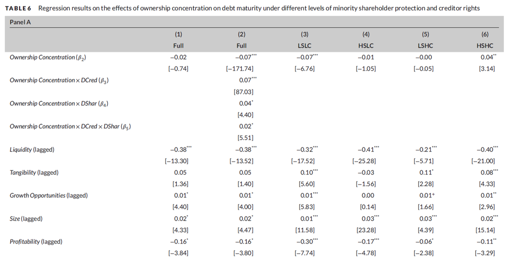

A decisão final é baseada na significância do Beta estimado. Se **significativo**, as variáveis são relacionadas e fazemos inferências em cima disso.

Contudo, **sem um design empírico inteligente**, o beta encontrado pode ter literalmente qualquer sinal e significância.

---

# Exemplo desses problemas

Veja esse [site](http://www.tylervigen.com/spurious-correlations)

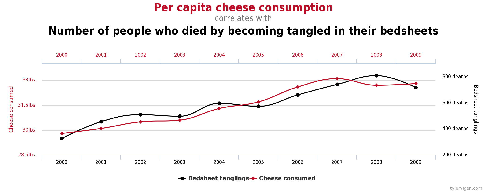

---

# Exemplo desses problemas

Veja esse [site](http://www.tylervigen.com/spurious-correlations)

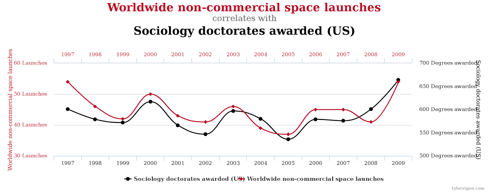

---

# Exemplo desses problemas

Source: [Angrist](https://www.youtube.com/watch?v=iPBV3BlV7jk)

**Não podemos pegar dois caminhos.**

---

# Exemplo desses problemas

Source: [Angrist](https://www.youtube.com/watch?v=6YrIDhaUQOE)

**Não podemos comparar pessoas que não são comparáveis.**

---

# O que precisamos fazer?

--

Definir um bom **_Design empírico_**

--

No mundo ideal: teríamos **universos paralelos.** Teríamos **dois clones**, em que cada um escolhe um caminho. Todo o resto é igual.

- Obviamente, isso não existe.

--

Segunda melhor solução: **experimentos**

--

**Mas o que é um experimento?**

- Grupo de tratamento vs. Grupo de controle

- Igualdade entre os grupos (i.e. Aleatoriedade)

    - Nada diferencia os grupos a não ser o fato de que um indivíduo recebe tratamento e o outro não
    - Estamos comparando maças com maças e laranjas com laranjas
      
- Testes placebo

---

# O que **conseguimos** fazer?

**Pareamento**

Source: [Angrist](https://www.youtube.com/watch?v=6YrIDhaUQOE)

---

# O que **conseguimos** fazer?

--

**Propensity-score matching**

- Fazemos **pareamento** entre amostras

--

- Para cada **individuo** que recebe o **tratamento**, **buscamos um indivíduo do grupo de controle**...

--

- ... que é o mais semelhante possível..
- Esses indivíduos foram um par.

--

- No agregado, teremos duas sub-amostras que são semelhantes entre si (indivíduos pareados).

--

- A seguir, fazemos inferências estatísticas **apenas** com essa sub-amostras.

--

- O resto da amostra, os indivíduos a que não se encontrou pares, **não é utilizada**.

---

# Exemplo de pareamento

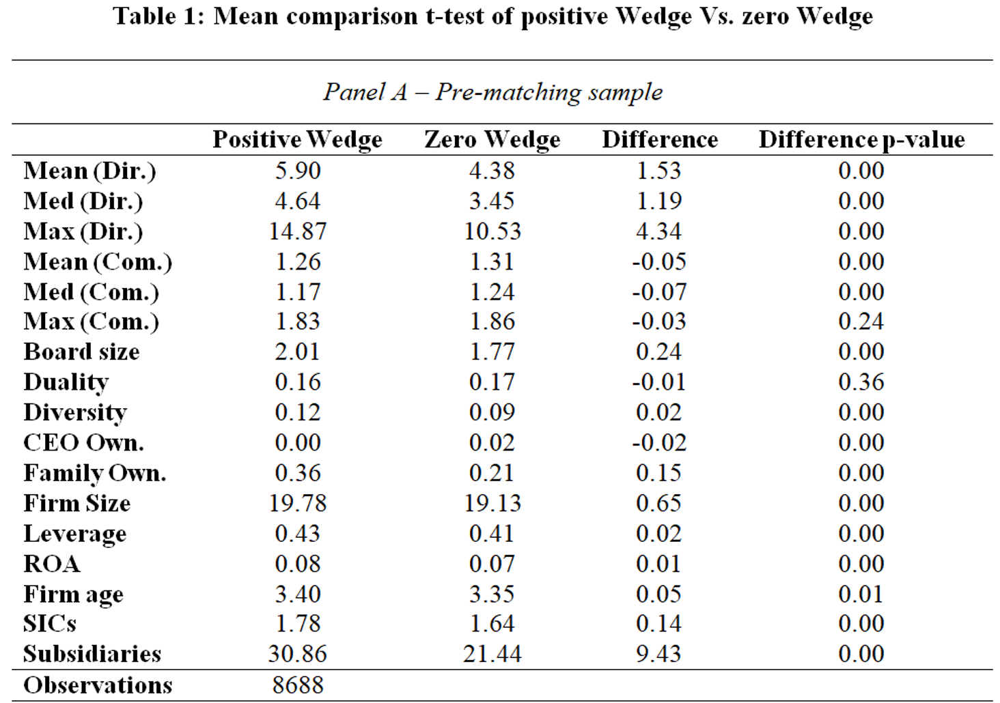

---

# Exemplo de pareamento

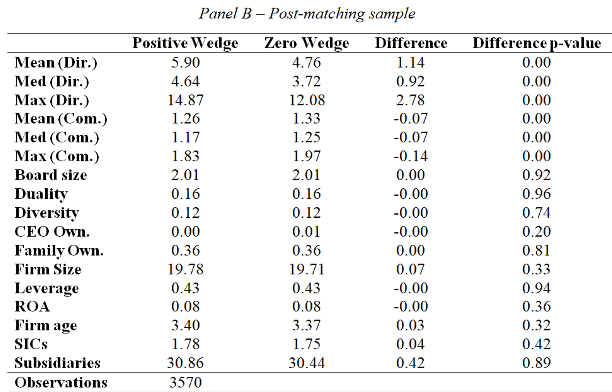

---

# O que **conseguimos** fazer?

**Differences-in-Differences**

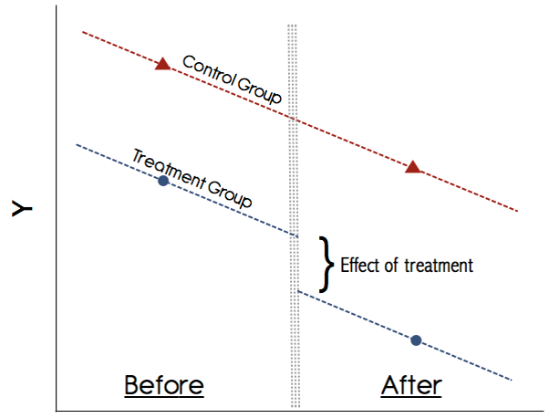

**Aqui, você precisa de um choque exógeno.**

---

# O que **conseguimos** fazer?

**Research Discontinuity Design (RDD)**

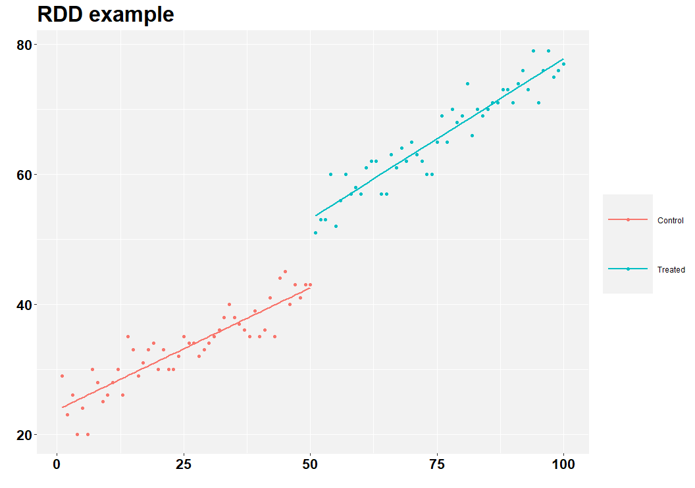

---

# O que **conseguimos** fazer?

**Research Discontinuity Design (RDD)**

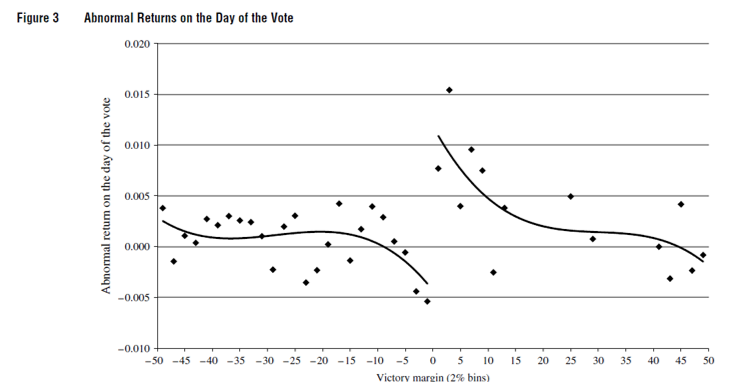

Artigo original [aqui](https://pubsonline.informs.org/doi/abs/10.1287/mnsc.2014.2038?casa_token=bxWTVtI6zLgAAAAA:lSAYRxrQiyJ9VzHVsQRBpt0IpYc7duGMdU6jPx0KIE1cQgxtZlpf4uzMN5SlKkDAN3MDsHmb8S0).

---

# O que **conseguimos** fazer?

**Controle sintético**

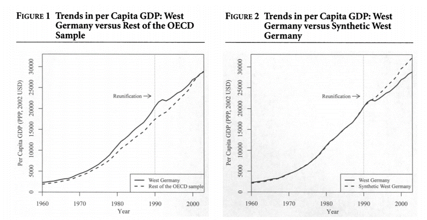

Artigo original [aqui](https://www.jstor.org/stable/pdf/24363579.pdf?refreqid=excelsior%3A4a9d49f1f99ebd90f77fee919aa901fb).

---

# O que **conseguimos** fazer?

**Controle sintético**

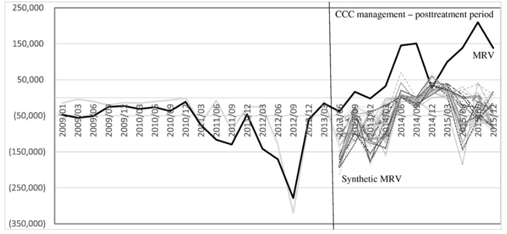

Artigo original [aqui](https://www.sciencedirect.com/science/article/pii/S0929119916303650?casa_token=fLFH1dexyCIAAAAA:q32Jb2txUKWI6jtxl3qUAauRxnbMGpK_jil3QG4tIXQrRm35Sxjrv3t1HV5kK2d1GCa1Oczo5Q).

---

# Conclusão

**Pesquisa quantitativa tem a parte _quanti (métodos, modelos, etc.)_...**

**... Mas talvez a parte mais importante seja o desenho da pesquisa (design empírico)!**

---

class: center, middle

# Highlights sobre Open Science (Ciência Aberta)

---

# Preocupações recentes em pesquisa

**P-Hacking**

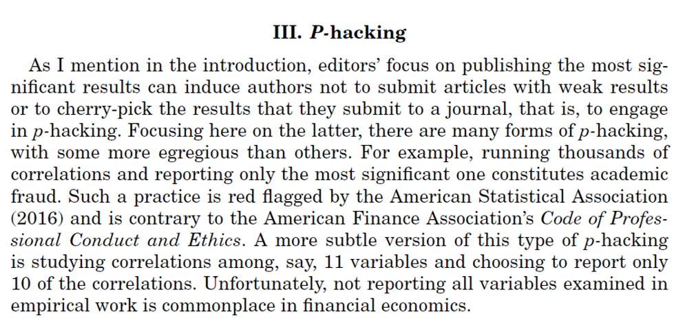

$$\\[0.5cm]$$

Artigo original [aqui](https://doi.org/10.1111/jofi.12530).

---

# Preocupações recentes em pesquisa

**Publication bias**

$$\\[0.5cm]$$

Artigo original [aqui](https://doi.org/10.1111/jofi.12530).

 
---

# Preocupações recentes em pesquisa 

**Crise de replicação**

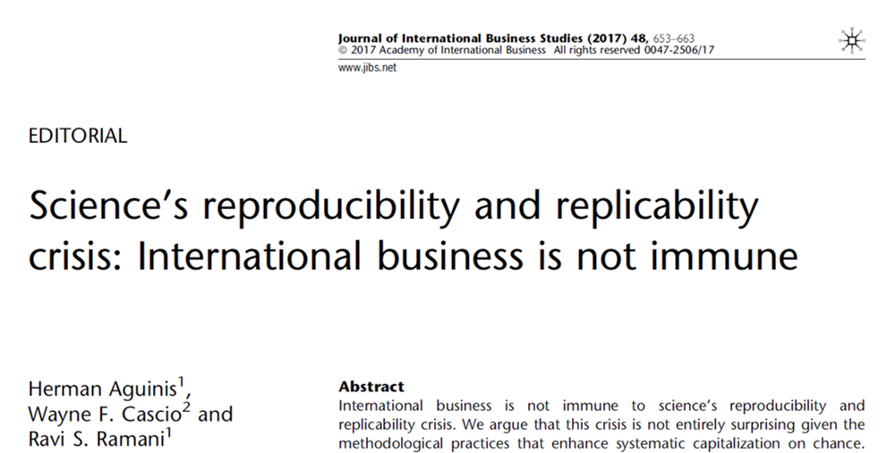

$$\\[1cm]$$

Artigo original [aqui](https://link.springer.com/article/10.1057/s41267-017-0081-0).

---

# Open Science (OS)

" _Open science encompasses unhindered access to scientific articles, **access to data from public research**, and **collaborative research** enabled by ICT tools and incentives._ 

_Broadening access to scientific publications and data is at the heart of open science, so that research outputs are in **the hands of as many as possible**, and potential benefits are **spread as widely as possible**_" ([OCDE](https://www.oecd.org/science/inno/open-science.htm)).

$$\\[0.4cm]$$
--

**É um movimento internacional, já presente em vários campos de pesquisa, com o objetivo de tornar a pesquisa acadêmica mais transparente, acessível e relevante.**

$$\\[0.4cm]$$
--

Exemplo mais recente: **Dados de COVID** ([link](https://www.oecd.org/coronavirus/policy-responses/why-open-science-is-critical-to-combatting-covid-19-cd6ab2f9/)).

---

# Open Science

- [Editorial Open Science](https://rac.anpad.org.br/index.php/rac/article/view/1376) - RAC 2020

- [Dados abertos](https://rac.anpad.org.br/index.php/rac/article/view/1384)

- Código e Materiais abertos

- Revisão pelos pares aberta

- [Artigos-tutoriais](https://rac.anpad.org.br/index.php/rac/article/view/1391) (Open Education)

- Apresentação completa sobre Open Science
    
    - [Seminário UFV](https://henriquemartins.net/seminar/2020-08-06-open-science/)
    - Praticada na [RAC](https://henriquemartins.net/slideslist/2020-11-19-rac-open-science/)
    

---

class: left

# Materiais Abertos 

- Após o artigo ser aceito, autores são convidados a disponibilizar os dados e demais materiais de pesquisa em **repositório público** 

    - [Mendeley data](https://data.mendeley.com/)
    - [Dataverse](https://dataverse.harvard.edu/)

--

- Exemplo, se você entrar aqui, **verá todos os passos empíricos** que os autores fizeram para chegar aos resultados que chegaram.

    - Você pode aprender o que eles fizeram
    - **Se você achar um erro**, você pode fazer contato para retratação ou pedir mais informações aos autores
    
--

- Materiais geram um doi que pode ser posteriormente **citado**. 

    - Exemplo: esse é o doi de um dos últimos artigos publicados na RAC: [https://doi.org/10.7910/DVN/ZXBMHD](https://doi.org/10.7910/DVN/ZXBMHD) em **10 de Novembro**.

---

class: right, middle

.left[ __Espero que tenham gostado!__ ] 

$$\\[2.25cm]$$

# *Find me at:*

[henriquemartins.net](https://henriquemartins.net/)

[hcm@iag.puc-rio.br](mailto:hcm@iag.puc-rio.br)

