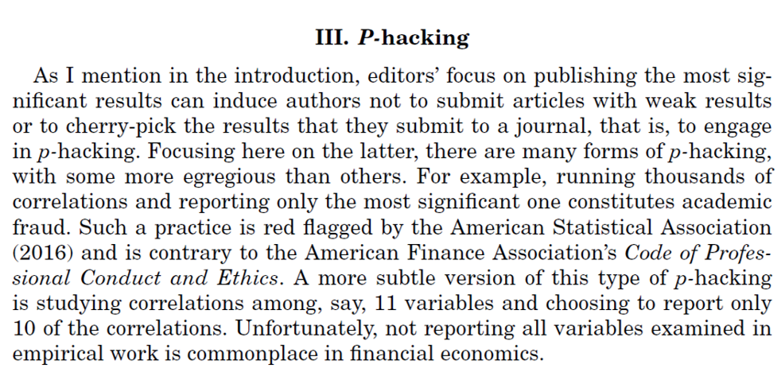

$$\\[6cm]$$
**My opinions do not represent those of the institution I work for.**

---

# The current state in (business) science

**Too many** articles...

--

... in **low-quality** journals.

--

**Scholars are  doing their best**

  - To get "tenure" (not a common concept in Brazil yet)
  - To increase reputation
  - Highly competitive environment (mental health is a problem)
  
  
--

**Journals are doing their best to increase impact**

  - Game of metrics
  - Highly competitive environment for journals

  
  

---
# Too many articles

Brazil 60k scientific articles in 2018: [data.orldbank][https://data.worldbank.org/indicator/IP.JRN.ARTC.SC?locations=BR]

World 2.554K scientific articles in 2018: [data.orldbank][https://data.worldbank.org/indicator/IP.JRN.ARTC.SC]

--

**Production of academic research is not a problem anymore.**

---

**Production of academic research is not a problem anymore.** [Source](https://www.scimagojr.com/countryrank.php?area=1400&year=2020).

---

**Production of academic research is not a problem anymore.** [Source](https://www.universityworldnews.com/post.php?story=20180905095203579).

---

# Recent problems in academic research

**P-Hacking**

$$\\[0.5cm]$$

Artigo original [aqui](https://doi.org/10.1111/jofi.12530).

---

# Recent problems in academic research

**Publication bias**

$$\\[0.5cm]$$

Artigo original [aqui](https://doi.org/10.1111/jofi.12530).

 
---

# Recent problems in academic research

**Replication crisis**

$$\\[1cm]$$

Artigo original [aqui](https://link.springer.com/article/10.1057/s41267-017-0081-0).

---

# Recent problems in academic research

[Source](https://onlinelibrary.wiley.com/doi/10.1111/jofi.13064).

---

# Recent problems in academic research

[Source](https://onlinelibrary.wiley.com/doi/10.1111/jofi.13064).

---

# Predatory journals

--

[Source](https://www.nature.com/articles/d41586-019-03759-y).

---

class: left

# Open Science (OS)

" _Open science encompasses unhindered access to scientific articles, **access to data from public research**, and **collaborative research** enabled by ICT tools and incentives._ 

_Broadening access to scientific publications and data is at the heart of open science, so that research outputs are in **the hands of as many as possible**, and potential benefits are **spread as widely as possible**_" ([OCDE](https://www.oecd.org/science/inno/open-science.htm)).

$$\\[0.4cm]$$
--

**É um movimento internacional, já presente em vários campos de pesquisa, com o objetivo de tornar a pesquisa acadêmica mais transparente, acessível e relevante.**

$$\\[0.4cm]$$
--

Exemplo relativamente recente: **Dados de COVID** ([link](https://www.oecd.org/coronavirus/policy-responses/why-open-science-is-critical-to-combatting-covid-19-cd6ab2f9/)).

---

# Open Science (OS)

- Dados abertos (Open Data)

- Código e Materiais abertos (Open Materials)

- Revisão pelos pares aberta (Open peer review)

- Artigos-tutoriais

- Reuso de Dados 

- Artigos depositados como preprints podem ser submetidos

$$\\[2cm]$$

Exemplo de política pode ser encontrada (RAC) [aqui](https://rac.anpad.org.br/index.php/rac/openscience).

---

class: left

# Revisão pelos pares aberta

- **Após o artigo ser aceito**, revisores são convidados a permitir que sua identificação apareça na versão final do artigo.

--

- Em paralelo, **revisores e autores são convidados** a permitir a publicidade do conteúdo dos seus reports e suas cartas de resposta.

    - Veja um exemplo [aqui](https://rac.anpad.org.br/index.php/rac/issue/view/148)

--

- **A revista não altera o conteúdo** dos pareceres em nenhuma situação (erros de digitação, por exemplo, são incluídos)
  

---

# Tips For Students Ethics 

- **If you are playing the quantity game, you are playing it wrong**.
    - Focus on quality, your whole 30-year career is a 10-20 ABS3 papers, not a 200+ papers.

--

- Understand the concept of a **Job Market Paper (quality paper)**
    - Doesn't need to be published by the end of your PhD, but senior enough to nice presentations 
    - It is also nice for master's students to have a strong paper in order to get into a PhD program.

--

- Do not send articles to  **predatory journals**
    - Those that are in the market can smell it.
    - If the project is not good, abandon it (instead of publishing in such journals)

--

- **Do not cheat**
    - The industry is getting better at finding wrongdoings.
    - At the end of the day, people talk about reputation.

---

class: right, middle

.left[ __I hope you liked it!__ ] 

$$\\[2.25cm]$$

# *Find me at:*

[henriquemartins.net](https://henriquemartins.net/)

[henrique.martins@fgv.br](mailto:henrique.martins@fgv.br)

