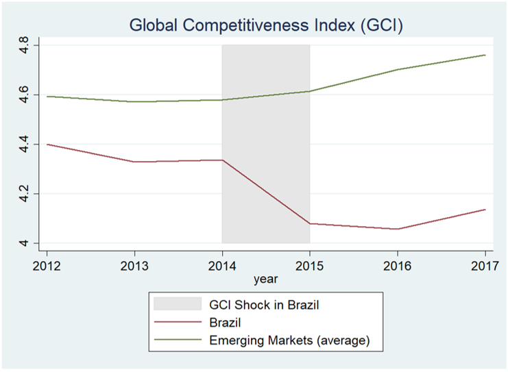
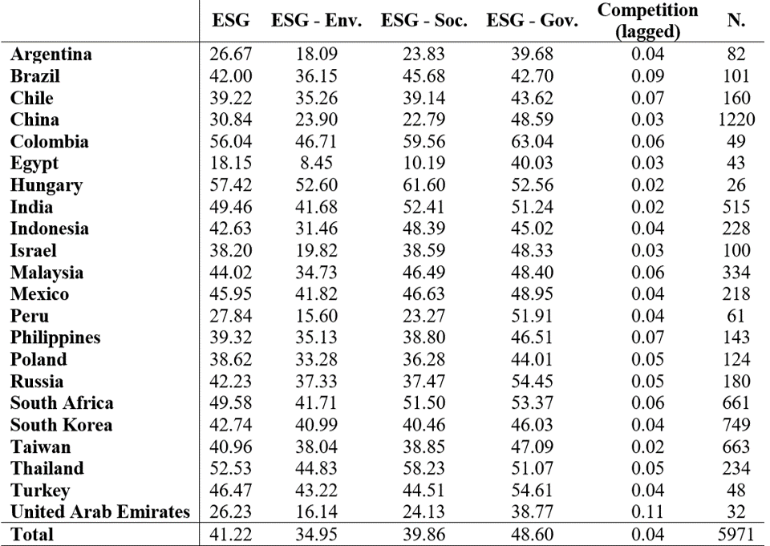
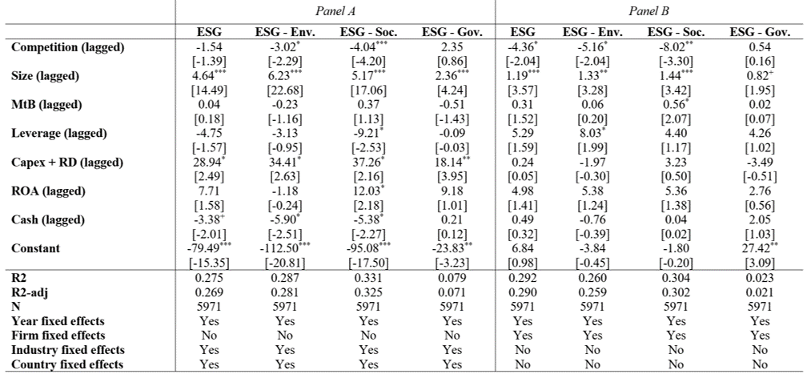
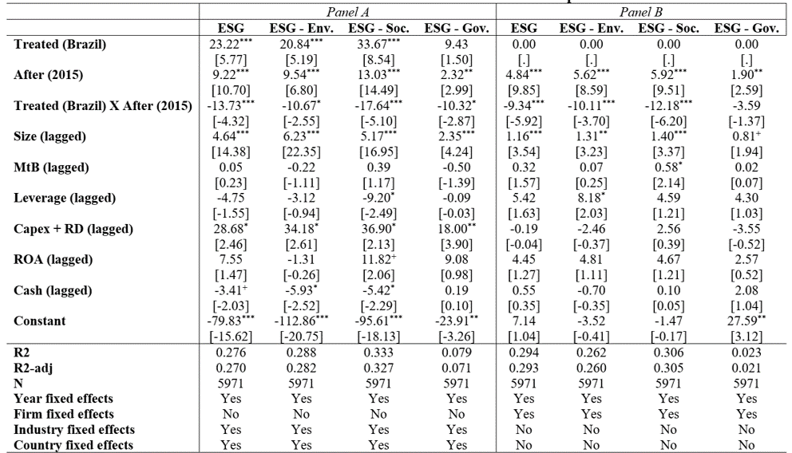
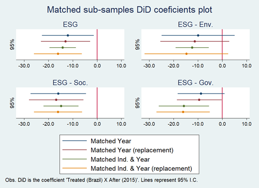
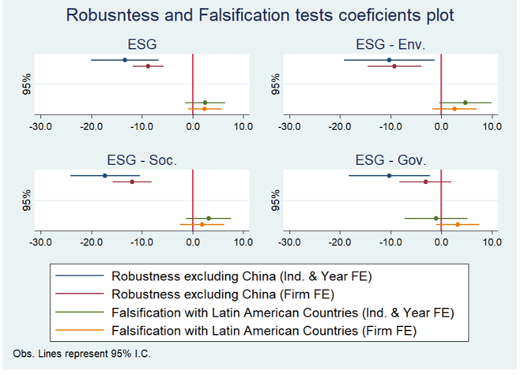
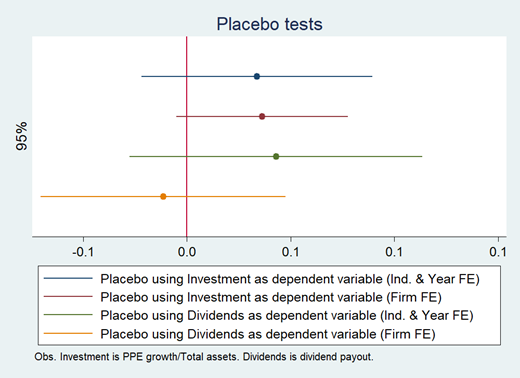

# Motivation

Over the last few years, there is a massive interest in **corporate ESG decisions (disclosure and performance)** from academia and practitioners.

--

To invest more in ESG practices, **corporations are facing pressure** from:

- Investors (Matos, 2020),
- Public opinion (Baldini, Dal Maso, Liberatore, Mazzi, & Terzani, 2018), 
- And peers (Cao, Liang, & Zhan, 2019)

--

However, antecedents and consequences of ESG practices **are not well defined** in the literature.

- There is **still a debate** whether such practices **increase or decrease firm value**, for instance.

---

# Motivation

The literature has two main hypotheses to explain why managers invest in ESG practices

--

**1) The altruist/agency conflict argument**

- It says that ESG practices are **value-decreasing decisions** and, thus, a form of **agency conflict**.

- The main reason managers invest in such practices is **altruism**.

    - I.e., they pursue some form of personal **reputation**.

--

**2) The strategic argument**

- It says that ESG practices are **value-increasing decisions** and, thus, a **way to differentiate** from competitors. **"Escape from competition" effect.**

- The main reason managers invest in such practices is to **find value in 'non-traditional' ways**.

--

Literature shows **conflicting evidences**: Barnea and Rubin (2010), Borghesi et al. (2014); Fernández-Kranz and Santaló (2010), Flammer (2015a), and Vural-Yavaç (2020). 

---

# But in Emerging Markets

The **'Escape from competition argument' is less likely to hold**, because:

- Worse Investor protection, higher agency problems

- Poor institutions, high corruption

- Corporate practices are more opaque

--

Thus, **stakeholders are less likely to evaluate correctly the returns of strategies based on ESG practices**, even profitable ones. 

--

*Hypothesis 1: Competition is negatively associated with corporate ESG practices.*

*Hypothesis 2: An increase in competition decreases corporate investment in ESG practices.*

---

# Shock in Competition: Brazil 2015

- Beginning of a **presidential impeachment**

- **Negative GDP growth** of about 3.5%

- Skyrocketing **inflation** of about 10.5%

- **Decrease in exports and imports** of goods and services of around 14% and 24%, respectively.

---

# Shock in Competition: Brazil 2015

*Source: World Economic Forum.*

---

# Sample

- Sample of **5.971 firm-year observations for 22 emerging economies** (Kearney, 2012)

- Period: **2011-2019**

- Database: **Thomson Reuters Eikon**

    - Financial and ESG data

- Two types of models:

    - Either **Firm FE or Country & Industry FE**
    - **DiD**: Brazil (treatment), 21 emerging markets (control), shock in 2015.
    - Yearly propensity-score matching over the observables, with and without replacement.

- Ind. Var.: **Competition** is the Herfindahl-Hirschman index

---

# Countries

**Brazil is not different than sample average**

---

# Models

**Model 1:**

$ESG_{i,t} = β_1 + β_2 × Competition_{i,t-1} + β_3 × Size_{i,t-1} + β_4 × MtB_{i,t-1} + \\ β_5 × Leverage_{i,t-1} + β_6 × Capex + RD_{i,t-1} + β_7 × ROA_{i,t-1} + \\ β_8 × Cash_{i,t-1} + ϕ_{time} + ϵ_{i,t}$

$$\\[0.5cm]$$

**Model 2:**

$ESG_{i,t} = β_1 + β_2 × Treated (Brazil) + β_3 × After (2015) + \\ β_4×Treated (Brazil) × After (2015) + β_5 × Size_{i,t-1} + β_6 × MtB_{i,t-1} + \\ β_7 × Leverage_{i,t-1} + β_8 × Capex + RD_{i,t-1} + β_9 × ROA_{i,t-1} + \\ β_{10} × Cash_{i,t-1} + ϕ_{time} + ϵ_{i,t}$

---

# Main Results (Model 1)

---

# Main Results (Model 2 - pre-matching)

---

# Main Results (Model 2 - post-matching)

---

# Main Results (Robustness and Falsification)

**Robustness: Excluding China**

**Falsification: "Shock" in Latin America Countries, instead of Brazil**

---

# Placebo tests (alternative Y's)

---
# Conclusions

- Product market competition leads to worse ESG practices in emerging markets.

--

- When competition increases, firms make trade-offs between alternative investment strategies.

--

- Which penalizes those assumed as less profitable in the short-term, such as ESG-related practices. 

    - Especially, E and S. Findings of G are more ambiguous.

--

- Results contradict US-based findings: Fernández-Kranz and Santaló (2010), Flammer (2015b), and Leong and Yang (2020).

    - This is the interesting part of this article.

--

- Managers from emerging markets **decrease ESG performance** to face **more challenging and uncertain times**, supporting the view that they invest in these practices for **altruistic** purposes.

---

class: right, middle

.left[ __Hope you like it!__ ] 

$$\\[2.25cm]$$

# *Find me at:*

[henriquemartins.net](https://henriquemartins.net/)

[hcm@iag.puc-rio.br](mailto:hcm@iag.puc-rio.br)

