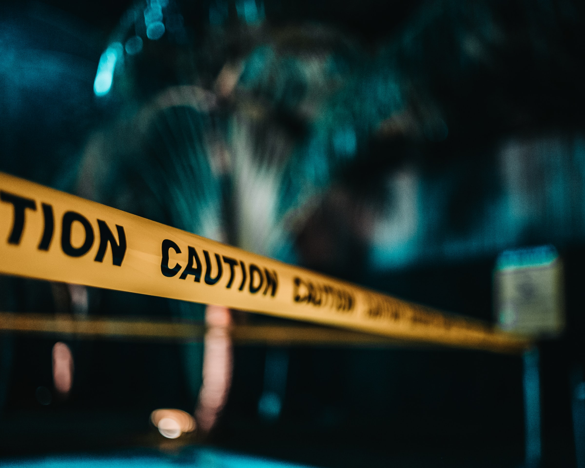
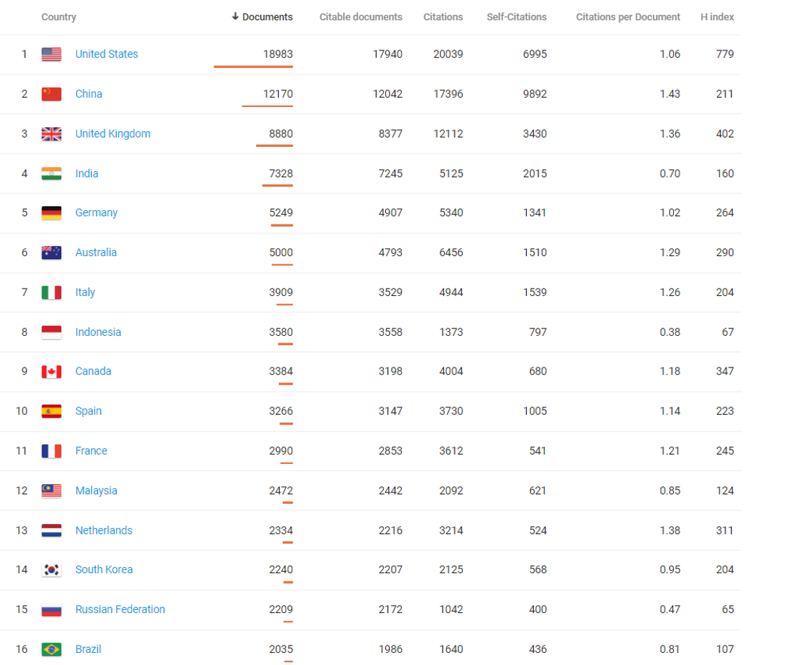
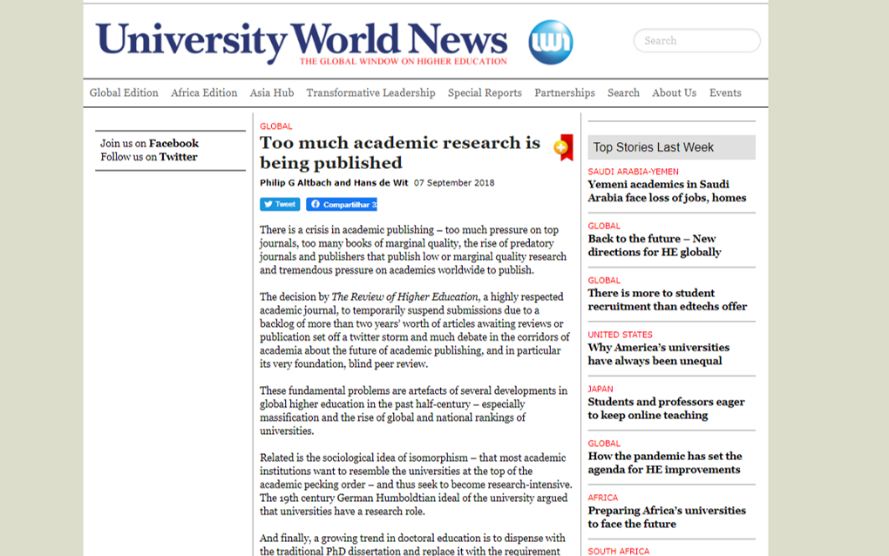
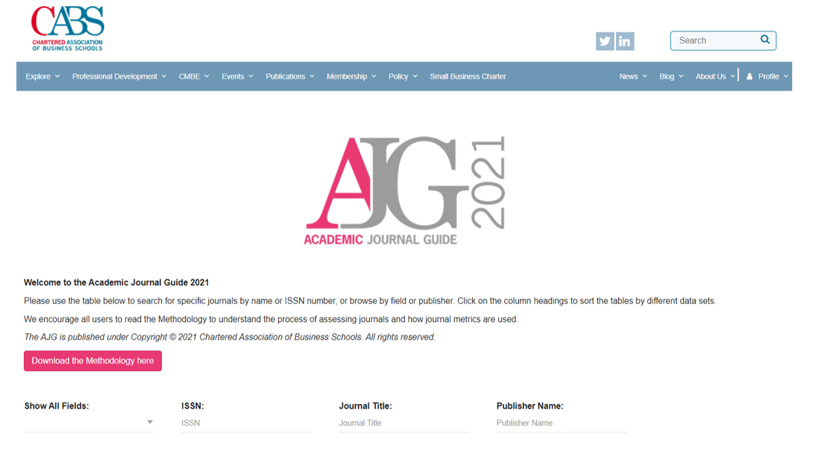
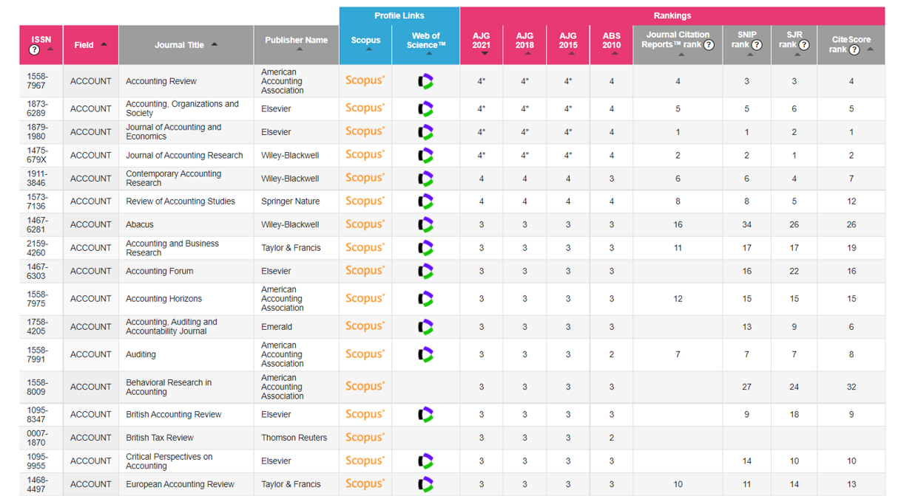

**My opinions do not represent those of the institution I work for.**

--

**I am a young scholar. What the H do I know?**

---

# The current state

**Too many** articles...

--

... in **low-quality** journals.

--

**Scholars are  doing their best**

  - To get "tenure" (not a common concept in Brazil yet)
  - To increase reputation
  - High competitive environment (mental health is a problem)
  
  
--

**Journals are doing their best to increase impact**

  - Game of metrics
  - High competitive environment for journals

  
  

---
# Too many articles

Brazil 60k scientific articles in 2018: [data.orldbank][https://data.worldbank.org/indicator/IP.JRN.ARTC.SC?locations=BR]

World 2.554K scientific articles in 2018: [data.orldbank][https://data.worldbank.org/indicator/IP.JRN.ARTC.SC]

--

**Production of academic research is not a problem anymore.**

---

**Production of academic research is not a problem anymore.** [Source](https://www.scimagojr.com/countryrank.php?area=1400&year=2020).

---

**Production of academic research is not a problem anymore.** [Source](https://www.universityworldnews.com/post.php?story=20180905095203579).

---

# International Standards

**ABS List** ([Site](https://charteredabs.org/academic-journal-guide-2021/))

 
 
 
 
---

# International Standards

**ABS List** ([Site](https://charteredabs.org/academic-journal-guide-2021/))
 
 
 
  
 
 
 
 
---

# International Standards

**ABS List** ([Site](https://charteredabs.org/academic-journal-guide-2021/))
  
  - A short (messy!) [list](https://henriquecastror-book-of-notes.netlify.app/journals-rankings.html).
  
--

**Focus is on**:
  - **ABS 4* ** (too competitive)
  - **ABS 4** (highly competitive)
  - **ABS 3** (competitive)
  - _ABS 2_ (there are good journals here)
  - _ABS 1_ (there might be a few good journals here)

  

--

_An international ranking list has several advantages over a national one_.

---

# International movements

**Open science**

" _Open science encompasses unhindered access to scientific articles, **access to data from public research**, and **collaborative research** enabled by ICT tools and incentives._ 

_Broadening access to scientific publications and data is at the heart of open science, so that research outputs are in **the hands of as many as possible**, and potential benefits are **spread as widely as possible**_" ([OCDE](https://www.oecd.org/science/inno/open-science.htm)).

$$\\[0.4cm]$$
--

**É um movimento internacional, já presente em vários campos de pesquisa, com o objetivo de tornar a pesquisa acadêmica mais transparente, acessível e relevante.**

$$\\[0.4cm]$$
--

Exemplo mais recente: **Dados de COVID** ([link](https://www.oecd.org/coronavirus/policy-responses/why-open-science-is-critical-to-combatting-covid-19-cd6ab2f9/)).

---

# International movements

**Open science**

  - **Open code**
  
  - **Open data**
  
  - **Open peer review**
  
  - Data **repositories**
      - **Need data?** Mendeley data, Dataverse, Data in Brief, ...

--

**Check this project:**

[Open Code Com](https://opencodecom.net/)

---
# Networks & Conferences

**I could not stress more** the importance of network, international contacts, and international co-authors...

- Many **relationships** are established during a conference
  - Pay attention to how many accents are there in a conference

--

- Best way to understand what is the **current game**
  - For instance, Finance: **Causal Inference Methods**

--

- Every section gives, at least, **one good idea** (and many bad ones)
--

- Pay attention to the **questions that senior scholars make**
  
  - They know better than you, if they don't know the answer, it is always nice to provide one (if possible)
  - Plus, your article will likely have an international audience 

---
# Papers about writing papers

1) Shepherd DA, Wiklund J. Simple Rules, Templates, and Heuristics! An Attempt to Deconstruct the Craft of Writing an Entrepreneurship Paper. Entrepreneurship Theory and Practice. 2020;44(3):371-390. https://doi:10.1177/1042258719845888
  

2) Jason A. Colquitt and Gerard George, 2011: Publishing in AMJ—Part 1: Topic Choice. AMJ, 54, 432–435, https://doi.org/10.5465/amj.2011.61965960

  - Part II, Part III, ...

---

# For Students

**If you are playing the quantity game, you are playing it wrong, in my opinion**.

--

  - Focus on quality, your whole 40-year career is a 20-ABS3 papers, not a 200+ papers

--

  - Understand the concept of a **Job Market Paper**
    - Doesn't need to be published by the end of your PhD, but senior enough to nice presentations 
    - Without one, your chances are lower.

--

  - Create a **single project**
    - You, yourself, and you alone
    - It shows that you execute all parts of a project
    - Also, helps to understand how to be a better tutor in the future
    - Your supervisor, better than anyone, will understand

--

  - Spend time on the **letter**
    - sometimes, the response **letter has more pages** than the article

---

# For Faculty

**The major output a professor can have is the positions their students get.**

  - Students are **future co-authors** 
      - Likely they'll know the literature better
  
  - The best articles, most likely, come **during your career**, not during the PhD of your student.
  
  - Brazilian standards need to change from a short-term (i.e., 4 years students) **to a long-term mindset** (i.e., relationship with the student and future outcomes).
      - Helps thinking more about quality than quantity.
    
    
    
    

---

class: right, middle

.left[ __Hope you like it!__ ] 

$$\\[2.25cm]$$

# *Find me at:*

[henrique.martins@fgv.br](henrique.martins@fgv.br)

[https://eaesp.fgv.br/en/faculty/henrique-castro-martins](https://eaesp.fgv.br/en/faculty/henrique-castro-martins)

[henriquemartins.net](https://henriquemartins.net/)

[https://www.linkedin.com/in/henriquecastror/](https://www.linkedin.com/in/henriquecastror/)

