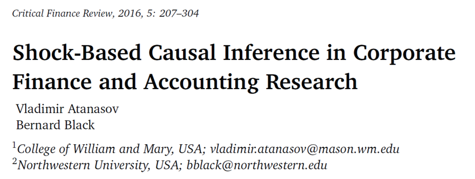

class: left

# The challenge

$$\\[1cm]$$

- I will discuss some issues in using  plain OLS models in Corporate Finance & Governance Research

--

- I will avoid the word “endogeneity” as much as I can

--

- I will also avoid the word “identification” because identification does not guarantee causality and vice-versa (Kahn and Whited 2017)

--

- The discussion is based on [Atanasov and Black (2016)](https://www.nowpublishers.com/article/Details/CFR-0036)

---

class: left

# The challenge

$$\\[0.75cm]$$

- Imagine that you want to investigate the effect of Governance on Q

    - You may have more covariates explaining Q (omitted  from slides)
    
$$\\[0.2cm]$$

 $𝑸_{i} = α + 𝜷_{i} × Gov + Controls + error$

$$\\[0.2cm]$$

--

 All the issues in next slides will make it not possible to infer that __changing Gov will _CAUSE_ a change in Q__ 
 
 That is, cannot infer causality
 

---

class: left

# 1) Reverse causation

$$\\[0.75cm]$$

_One source of bias is: reverse causation_

- Perhaps it is Q that causes Gov

- OLS based methods do not tell the difference between these two betas:

$$\\[0.2cm]$$

$𝑄_{i} = α + 𝜷_{i} × Gov + Controls + error$

$Gov_{i} = α + 𝜷_{i} × Q + Controls + error$

$$\\[0.2cm]$$

- If one Beta is significant, the other will most likely be significant too

- You need a sound theory!

---

class: left

# 2) Omitted variable bias (OVB)

_The second source of bias is: OVB_

- Imagine that you do not include an important “true” predictor of Q

- Let's say, long is:  $𝑸_{i} = 𝜶_{long} + 𝜷_{long}* gov_{i} + δ * omitted + error$

- But you estimate short:  $𝑸_{i} = 𝜶_{short} + 𝜷_{short}* gov_{i} + error$

- $𝜷_{short}$ will be: 

    - $𝜷_{short} = 𝜷_{long}$ +  relationship between omitted (omitted) and included (Gov) * effect of omitted in long (δ)

        - Where: relationship between omitted (omitted) and included (Gov) is: $Omitted = 𝜶 + ϕ *gov_{i} + u$

- Thus, OVB is: $𝜷_{short} – 𝜷_{long} = ϕ * δ$

- See an example in r [here](https://www.youtube.com/watch?v=-Il68vTUI5I)

---

# 3) Specification error

$$\\[0.75cm]$$

_The third source of bias is: Specification error_

- Even if we could perfectly measure gov and all relevant covariates, we would not know for sure the functional form through which each influences q

    - Functional form: linear? Quadratic? Log-log? Semi-log?

- Misspecification of x’s is similar to OVB

- Poor specification leads to bias

---

# 4) Signaling

$$\\[0.75cm]$$

_The fourth source of bias is: Signaling_

- Perhaps, some individuals are signaling the existence of an X without truly having it:

    - For instance: firms signaling they have good governance without having it

- This is similar to the OVB because you cannot observe the full story

---

# 5) Simultaneity

$$\\[0.75cm]$$

_The fifth source of bias is: Simultaneity_

- Perhaps gov and some other variable x are determined simultaneously

- Perhaps there is bidirectional causation, with q causing gov and gov also causing q 

- In both cases, OLS regression will provide a biased estimate of the effect

- Also, the sign might be wrong

---

# 6) Heterogeneous effects

$$\\[0.75cm]$$

_The sixth source of bias is: Heterogeneous effects_

- Maybe the causal effect of gov on q depends on observed and unobserved firm characteristics:

    - Let's assume that firms seek to maximize q
    - Different firms have different optimal gov
    - Firms know their optimal gov
    - If we observed all factors that affect q, each firm would be at its own optimum and OLS regression would give a non-significant coefficient

- In such case, we may find a positive or negative relationship.

- Neither is the true causal relationship

---

# 7) Construct validity

$$\\[0.75cm]$$

_The seventh source of bias is: Construct validity_

- Some constructs (e.g. Corporate governance) are complex, and sometimes have conflicting mechanisms

- We usually don’t know for sure what “good” governance is, for instance

- It is common that we use imperfect proxies

- They may poorly fit the underlying concept

---

# 8) Measurement error

$$\\[0.4cm]$$

_The eighth source of bias is: Measurement error_

- "Classical" measurement error for the outcome will inflate standard errors but will not lead to biased coefficients. 

    - $y^{*} = y + \sigma_{1}$
    - If you estimante $y^{*} = f(x)$, you have $y + \sigma_{1} = x + \epsilon$ 
    - $y = x + u$ 
        - where $u = \epsilon + \sigma_{1}$ 

- "Classical" random measurement error in x’s will bias coefficient estimates toward zero

    - $x^{*} = x + \sigma_{2}$
    - Imagine that $x^{*}$ is a bunch of noise
    - It would not explain anything
    - Thus, your results are biased toward zero

<!-- https://web.stanford.edu/class/polisci100a/regress5.pdf  --> 

---

# 9) Observation bias

$$\\[0.75cm]$$

_The ninth source of bias is: Observation bias_

- This is analogous to the Hawthorne effect, in which observed subjects behave differently because they are observed

- Firms which change gov may behave differently because their managers or employees think the change in gov matters, when in fact it has no direct effect

<!-- https://unsplash.com/photos/mqWmhw269CM -->

---

# 10) Interdependent effects

$$\\[0.75cm]$$

_The tenth source of bias is: Interdependent effects_

- Imagine that a governance reform that will not affect share prices for a single firm might be effective if several firms adopt

- Conversely, a reform that improves efficiency for a single firm might not improve profitability if adopted widely because the gains will be competed away

- "one swallow doesn't make a summer" 

---

# 11) Selection bias

$$\\[0.75cm]$$

_The eleventh source of bias is: Selection bias_

- If you run a regression with two types of companies

    - High gov (let's say they are treated)
    - Low gov (let's say they are control)
    
    
- Without any matching method, these companies are likely not comparable

- Thus, the estimated beta will contain selection bias

- The bias can be either be positive or negative

- It is similar to OVB

  
---

# 12) Self-Selection

$$\\[0.75cm]$$

_The twelfth source of bias is: Self-Selection_

- Self-selection is a type of selection bias

- Usually, firms decide which level of governance they adopt

- There are reasons why firms adopt high governance

    - If observable, you need to control for
    - If unobservable, you have a problem

- It is like they "self-select" into the treatment 

    - Units decide whether they receive the treatment of not

- Your coefficients will be biased

---

class: right, middle

.left[ __I hope you like this class!__ ] 

$$\\[2.25cm]$$

# *Find me at:*

[henriquemartins.net](https://henriquemartins.net/)

[hcm@iag.puc-rio.br](mailto:hcm@iag.puc-rio.br)

