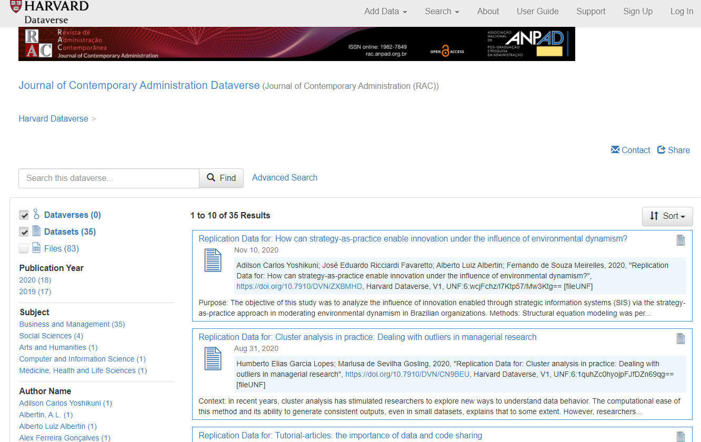
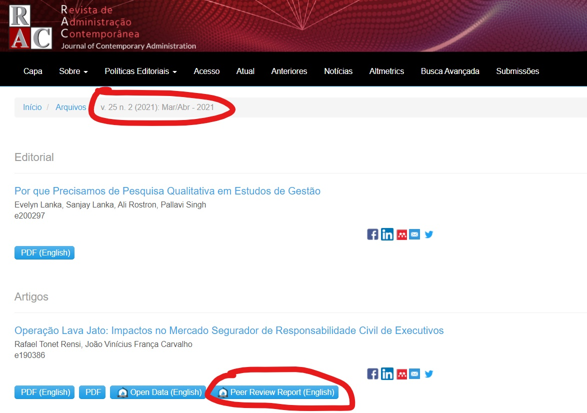

$$\\[6cm]$$
**Todos os comentários são opiniões minhas, não representam a opinião das instituições de que faço parte.**

---

class: left

# Open Science (OS)

" _Open science encompasses unhindered access to scientific articles, **access to data from public research**, and **collaborative research** enabled by ICT tools and incentives._ 

_Broadening access to scientific publications and data is at the heart of open science, so that research outputs are in **the hands of as many as possible**, and potential benefits are **spread as widely as possible**_" ([OCDE](https://www.oecd.org/science/inno/open-science.htm)).

$$\\[0.4cm]$$
--

**É um movimento internacional, já presente em vários campos de pesquisa, com o objetivo de tornar a pesquisa acadêmica mais transparente, acessível e relevante.**

$$\\[0.4cm]$$
--

Exemplo mais recente: **Dados de COVID** ([link](https://www.oecd.org/coronavirus/policy-responses/why-open-science-is-critical-to-combatting-covid-19-cd6ab2f9/)).

---

# Open Science (OS) na RAC

- [Dados abertos](https://rac.anpad.org.br/index.php/rac/article/view/1384)

- Código e Materiais abertos

- Revisão pelos pares aberta

- [Artigos-tutoriais](https://rac.anpad.org.br/index.php/rac/article/view/1391) (Open Education)

- Call for papers sobre [Reuso de Dados](https://zenodo.org/record/3858031#.Xs5VoGhKjDd) 

- Artigos depositados como preprints podem ser submetidos

$$\\[2cm]$$

Política completa pode ser encontrada [aqui](https://rac.anpad.org.br/index.php/rac/openscience).

Declaração de Ciência Aberta pode ser encontrada  [aqui](https://rac.anpad.org.br/index.php/rac/about/submissions).

---

class: left

# Dados Abertos - Como a RAC faz?

- **Artigos teóricos: não há compartilhamento**:

    - Os autores devem informar caráter teórico na Declaração de Ciência Aberta.

--

- **Dados primários: Compartilhamento obrigatório**

    - Dados gerados pelos autores, questionários, entrevistas, etc.

--

- **Dados secundários: Compartilhamento obrigatório**

    - Banco Mundial, Ipeadata, dados governamentais, etc.
--

- **Dados reutilizados: Compartilhamento obrigatório**

    - Dados em repositórios públicos (Dataverse, Mendeley, etc.)
--

- **Dados de experimentos: Compartilhamento obrigatório**

    - Experimentos de laboratório, etc.

---

class: left

# Dados Abertos - Como a RAC faz?

- **Dados de Simulação: Compartilhamento obrigatório**

    - Dados gerados dentro de um código ou protocolo de pesquisa,
--

- **Códigos e protocolos de pesquisa: Compartilhamento obrigatório**

     - Scripts, códigos, designs de entrevistas, coleta estruturada de dados, programas, etc.

---

class: left

# Dados Abertos - Como a RAC faz?

- **Dados proprietários**: 

    - Dados coletados em bancos, como Economática, Compustat, etc.
    
    - Autores devem **compartilhar** ou **explicar** razão de não compartilharem. 
--

    - Se não tiverem direitos legais sobre os dados, **os autores deverão**:

        - Apresentar **código** com comandos para baixar os dados da fonte original,
        - Apresentar **tabela** com nome / título da variável / dados, conforme definido pela fonte original,
        - Comprometer-se a **apoiar editores e revisores** que tentarem replicar resultados.
        

---

class: left

# Materiais Abertos - Como a RAC faz?

- Após o artigo ser aceito, autores são convidados a disponibilizar os dados e demais materiais de pesquisa em **repositório público** (estamos preferindo o [Mendeley data](https://data.mendeley.com/)).

--

- Em seguida, materiais são centralizados no [Dataverse da RAC](https://dataverse.harvard.edu/dataverse/rac).

--

- Materiais geram um doi que pode ser posteriormente **citado**. 

    - Exemplo: esse é o doi de um dos últimos artigos publicados na RAC: [https://doi.org/10.7910/DVN/ZXBMHD](https://doi.org/10.7910/DVN/ZXBMHD) em **10 de Novembro**.

---

---

class: left

# Revisão pelos pares aberta - Como a RAC faz?

- **Após o artigo ser aceito**, revisores são convidados a permitir que sua identificação apareça na versão final do artigo.

--

- Em paralelo, **revisores e autores são convidados** a permitir a publicidade do conteúdo dos seus reports e suas cartas de resposta.

    - Veja um exemplo [aqui](https://rac.anpad.org.br/index.php/rac/issue/view/148)
    
--

- **A RAC não altera o conteúdo** dos pareceres em nenhuma situação (erros de digitação, por exemplo, são incluídos)
  
    - Somente comentários que violem a ética (comentários depreciativos ou difamatórios) serão editados (omitidos) do relatório. 
    - Nesses casos, será declarado que partes do relatório foram editadas. 

---

Exemplo [aqui](https://zenodo.org/record/4002421).

---

class: right, middle

.left[ __Espero que tenham gostado!__ ] 

$$\\[2.25cm]$$

# *Find me at:*

[henriquemartins.net](https://henriquemartins.net/)

[hcm@iag.puc-rio.br](mailto:hcm@iag.puc-rio.br)

